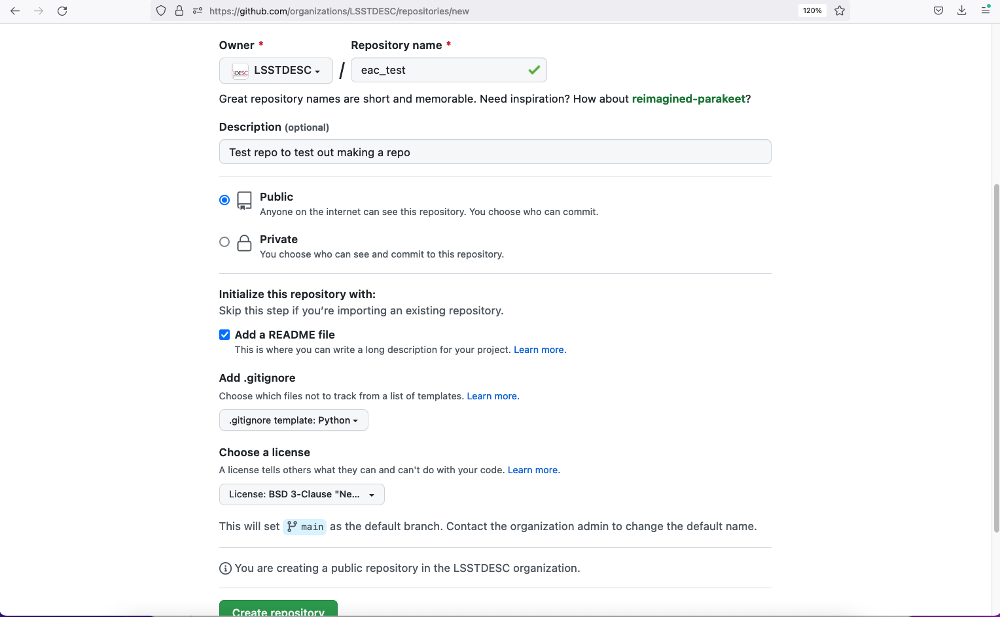
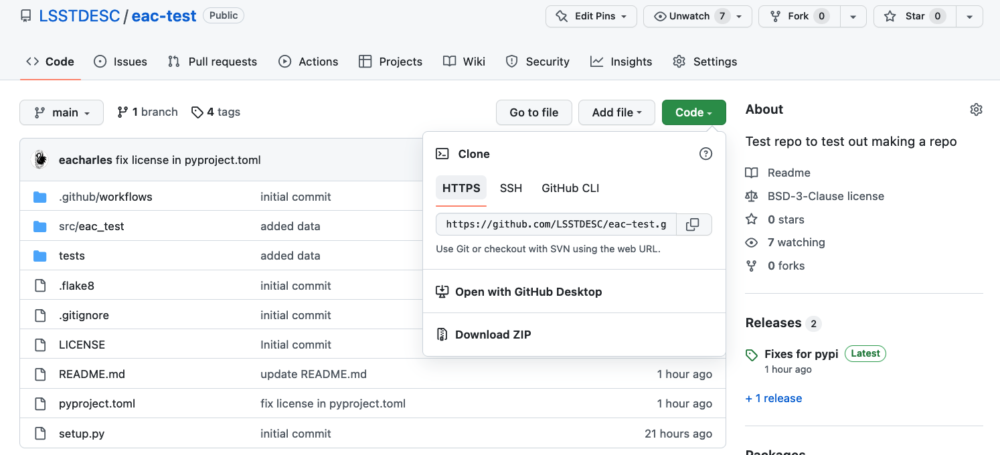
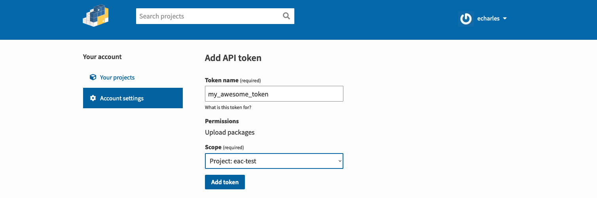
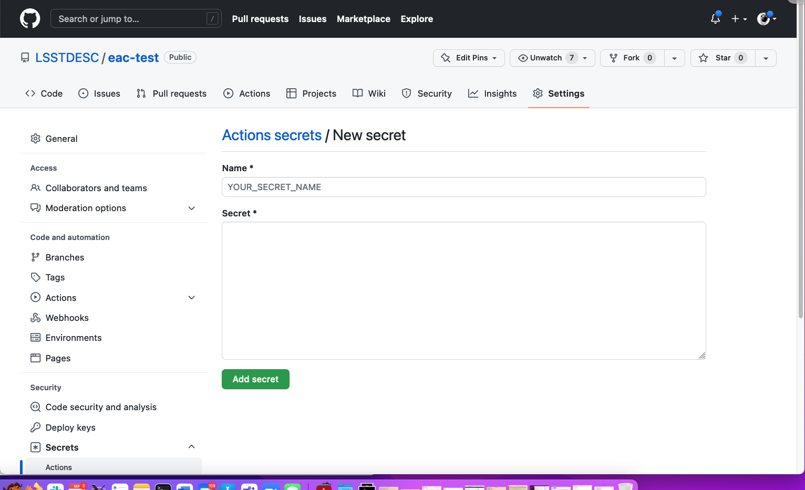
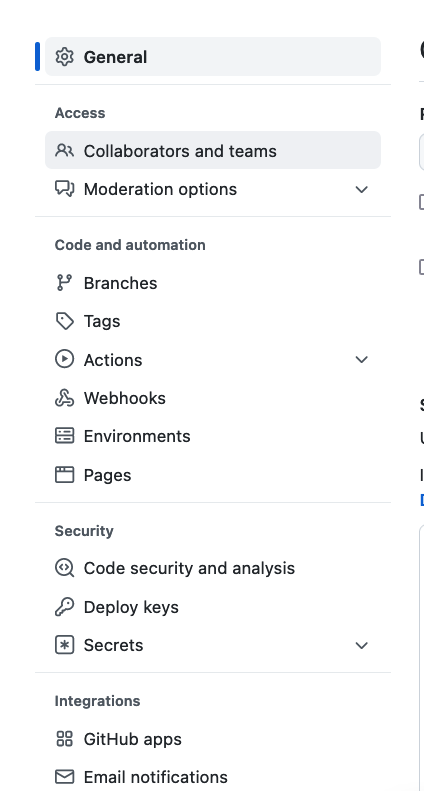
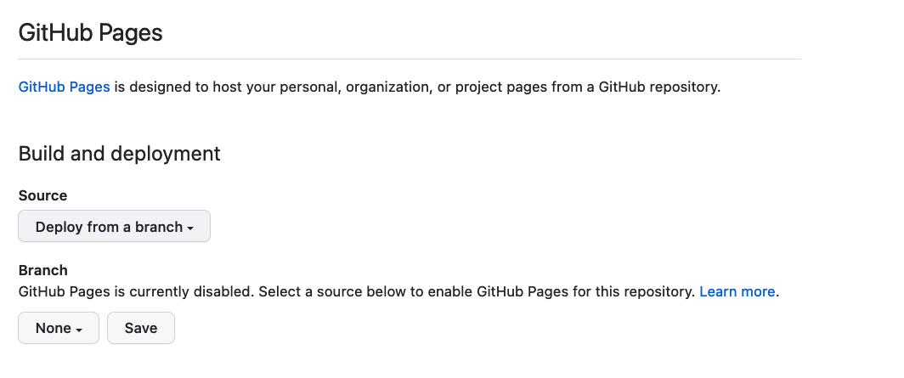
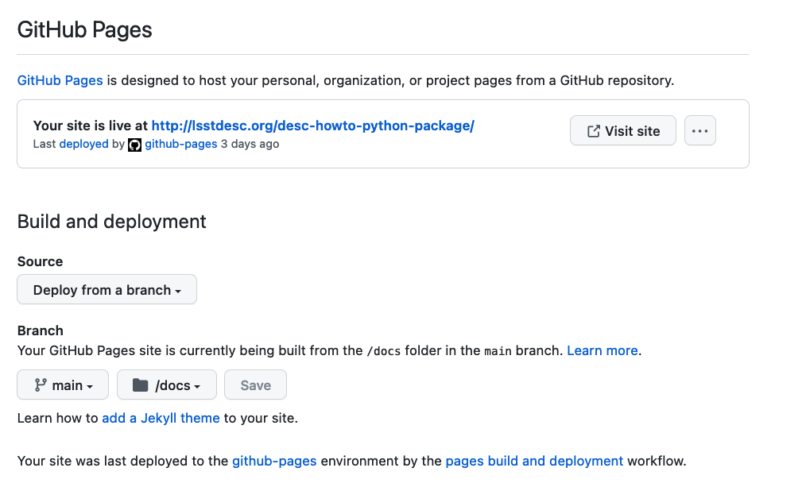

# Building and maintaining a python package for DESC

### Purpose

The information below will help you create a package for Python source
code in the DESC GitHub repository which:

1. can be built using standard tools
2. handles versioning sensibly
3. can accommodate automated code checking, testing, and release creation
4. is pip-installable

### Creating a python package

Start of by going to the DESC GitHub [repository creation
page](https://github.com/organizations/LSSTDESC/repositories/new) 

Pick sensible answers for the various questions and then click on the 
"Create repository" big green button.

Here are some sensible answers:

Pro-tip: navigate to the page for your newly created repository, e.g., 
[desc-howto-python-package](https://github.com/LSSTDESC/desc-howto-python-package) and click on the
"Code" pull down menu and click on the two little boxes next to the URL
to copy the URL to your clipboard.

Open a terminal on your computer and navigate to the place you want to
install the package (such as $HOME/software/desc/), then clone the repository.

	cd $HOME/software/desc # Or where you think that code wants to live
	git clone https://github.com/LSSTDESC/<package>.git
	cd <package>

Make the basic package structure

	mkdir src
	mdkir src/<package> # This is where your code goes
	mkdir tests
	mkdir tests/<package> # This is where your tests go
	mkdir docs
	mkdir .github
	mkdir .github/workflows # This is where the GitHub actions go 
	
	
Add the python packaging and configuration stuff, you can copy these files
from this package to get started.

	pyproject.toml # required
	setup.py # required
	.flake8 # optional, useful if you want to use flake8 for code checking
	.github/workflows/main.yml # really useful for automated testing
	.github/workflows/pypi.yml # really useful to automatically releases
	
	
Edit pyproject.toml.  You will need to make several changes (substituting your repository name, etc.):

Change these fields in the '[project]' block:

	[project]
	name = "desc-howto-python-package"
	description = "Test package to test packing"
	authors = [
		{ name = "Eric Charles", email = "echarles@slac.stanford.edu" }
	]
	dependencies = [
		"numpy",
	]

Change this field in the setup block to enable versioning based on the
git tag.

	[tool.setuptools_scm]
	write_to = "src/desc_howto_python_package/_version.py"
	
If you have data you would like to package with the source code, add a
	block like this:
	
	[tool.setuptools.package-data]
	"desc_howto_python_package.data" = ["*.txt"]

Point the coverage tools at the right code

	[tool.coverage.run]
	source = ["desc_howto_python_package"]
	
	
	[tool.pytest.ini_options]
	addopts = [
		"--cov=desc_howto_python_package",

Add your code and tests to 'src' and 'tests' directories.

If you want the `__version__` set automatically, add these lines to
your package `__init__.py`  file.

	def find_version():
		"""Find the version"""
		# setuptools_scm should install a
		# file _version alongside this one.
		from . import _version
		return _version.version
	
	try:
		__version__ = find_version()
	except ImportError: # pragma: no cover
		__version__ = "unknown"

### Creating a tag and putting the package on pypi

You can navigate directly to the new release page for your package, for
example
[https://github.com/LSSTDESC/desc-howto-python-package/releases/new](https://github.com/LSSTDESC/desc-howto-python-package/releases/new)

From there, click on "Choose a tag" pulldown menu and pick a tag
following the vX.X.X convention, e.g., v0.0.0 and pick a name and add
notes (or click the "Generate release notes") button.  Then click
"Publish release".

At this point GitHub will make the tag, and try to push the release to
pypi, but fail, because you have to do that by hand.

So, you will have to make yourself a pypi account.  You can do that at
[https://pypi.org/account/register/](https://pypi.org/account/register/)

Then update your release to use the latest tag and build it locally

	pip install twine
	git pull
	python setup.py sdist bdist_wheel
	twine upload dist/*
	

Then navigate to your pypi package managing page:
[https://pypi.org/manage/projects/](https://pypi.org/manage/projects/)

Select "Manage" for your package, then "Settings", the "Create a token
for <your package". Them put in some sensible values, e.g.,:

Make sure to copy the token to your clipboard.

Then, on GitHub navigate to the secrets page for your package
(click Settings -> Secrets -> Actions -> New repository secret) or go to
https://github.com/LSSTDESC/<your_package>/settings/secrets/actions/new

For Name* use `PYPI_API_TOKEN` and paste the token into the Secret*
field.

At this point, any time you make a new release, your package should
automatically get pushed onto pypi.

### Setting up documentation of GitHub pages

You can setup the GitHub repository to export documentation to the
GitHub pages system with a few simple steps.   Following these steps
will allow you to write markdown in the "docs" area of your repository
which will be rendered into pages available at, e.g., :
[https://lsstdesc.org/desc-howto-python-package/](https://lsstdesc.org/desc-howto-python-package/)

1. Start off by making and committing a "docs/index.md" file with a few
   lines just to make sure you have something to test.  And make sure
   that you push that to your main branch.

2. Navigate to the settings page for your repository, e.g., 
[https://github.com/LSSTDESC/desc-howto-python-package/settings](https://github.com/LSSTDESC/desc-howto-python-package/settings)

3. Select "Pages" from the left sidebar

4. You should have a page that looks like this:

5. Leave "Source -> Deploy from a branch" selected

6. Under "Branch" switch the selection from "None" to "main" and make
   sure to select "/docs" folder, then press "Save".
   
7. Once it has deployed the documentation it will look like this:

More info is available on the GitHub instructions pages: [https://docs.github.com/en/pages/quickstart](https://docs.github.com/en/pages/quickstart)

<!--  LocalWords:  desc-howto-python-package mdkir pyproject.toml setup.py cov github
 -->
<!--  LocalWords:  numpy tool.setuptools_scm desc_howto_python_package.data desc_howto_python_package
 -->
<!--  LocalWords:  addopts __init__.py setuptools_scm pypi sdist
 -->
<!--  LocalWords:  bdist_wheel __init__.py __init__.py
 -->
